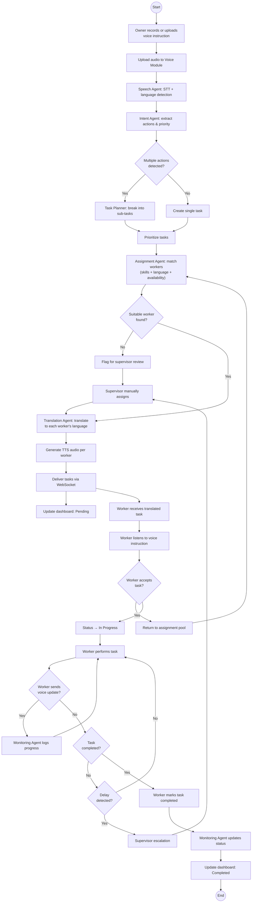
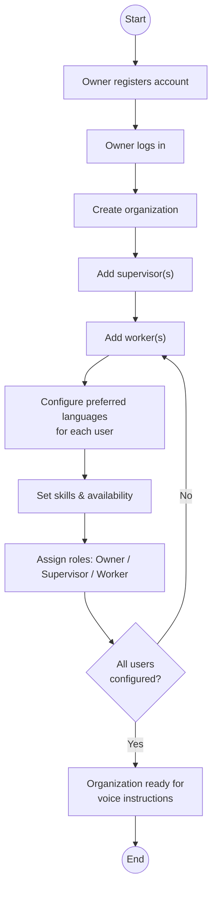
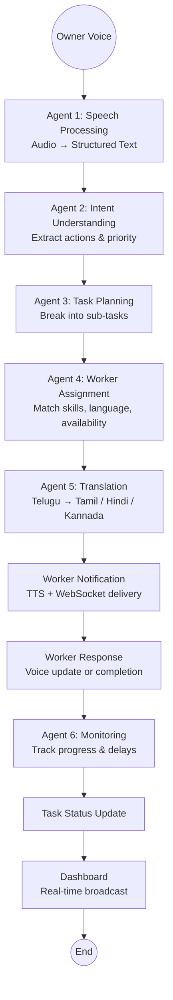
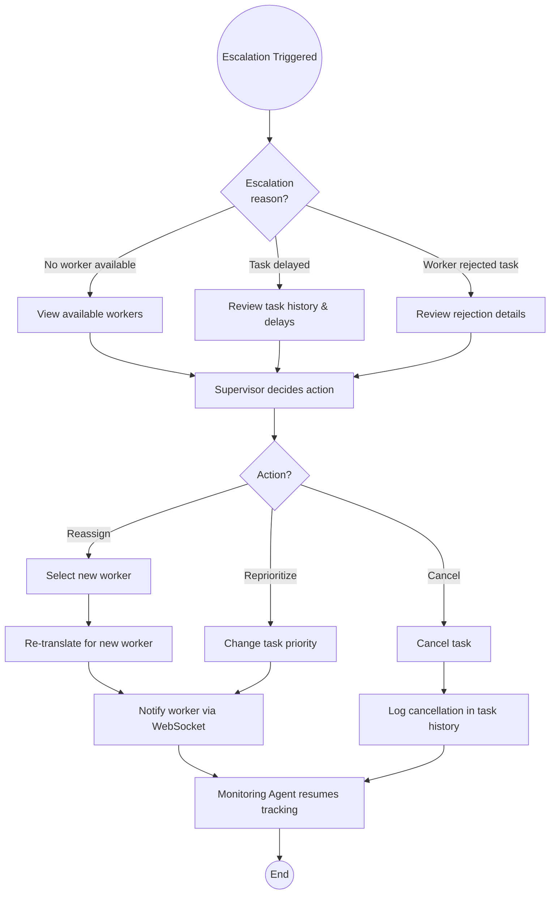
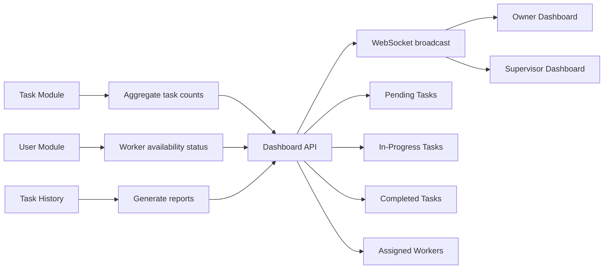

# Activity Diagram

Business process workflows for the Multilingual Voice-Based Workforce Management Agent.

## 1. Voice Instruction to Task Completion (Main Flow)

## 2. Organization & User Setup

## 3. LangGraph Agent Workflow

## 4. Supervisor Escalation Handling

## 5. Dashboard Data Flow

