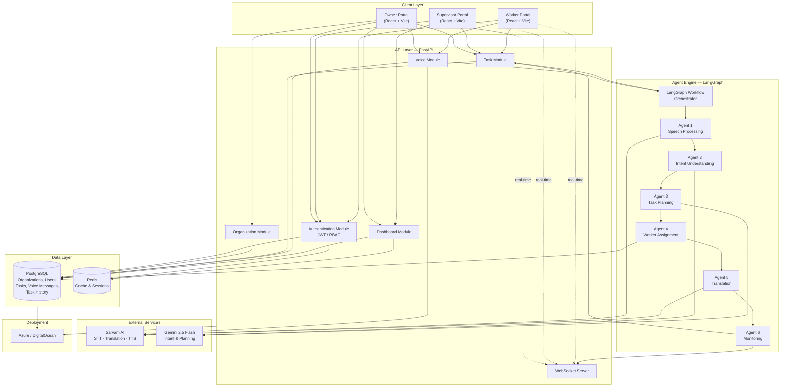
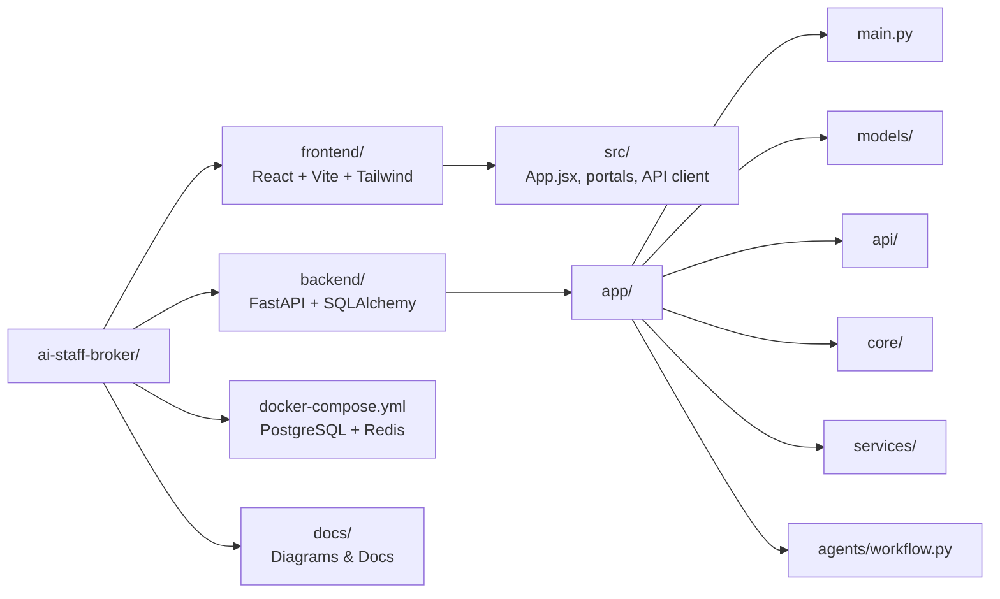

# Architecture Diagram

High-level system architecture for the Multilingual Voice-Based Workforce Management Agent MVP.

## System Architecture Overview

## Monorepo Structure

## Agent Pipeline Architecture

```mermaid
flowchart LR
    AUDIO["Owner Audio<br/>(Telugu)"] --> STT["Speech Agent<br/>Sarvam STT"]
    STT --> TEXT["Structured Text<br/>+ Language Detection"]
    TEXT --> INTENT["Intent Agent<br/>Gemini"]
    INTENT --> PLAN["Task Planner<br/>Gemini"]
    PLAN --> ASSIGN["Assignment Agent<br/>Skills + Language Match"]
    ASSIGN --> TRANS["Translation Agent<br/>Sarvam"]
    TRANS --> TTS["Text-to-Speech<br/>Sarvam TTS"]
    TTS --> NOTIFY["Worker Notification<br/>WebSocket"]
    NOTIFY --> RESPONSE["Worker Voice Response"]
    RESPONSE --> MONITOR["Monitoring Agent"]
    MONITOR --> DASHBOARD["Dashboard Update"]
```

## Technology Stack

| Layer | Technology |
|-------|------------|
| Frontend | React, Vite, TailwindCSS, React Router, Axios |
| Backend | FastAPI, Uvicorn, SQLAlchemy |
| Agent Framework | LangGraph |
| LLM | Gemini 2.5 Flash |
| Speech / Translation / TTS | Sarvam AI |
| Database | PostgreSQL 15 |
| Cache | Redis 7 |
| Real-time | WebSockets |
| Authentication | JWT + RBAC |
| Deployment | Azure or DigitalOcean |
