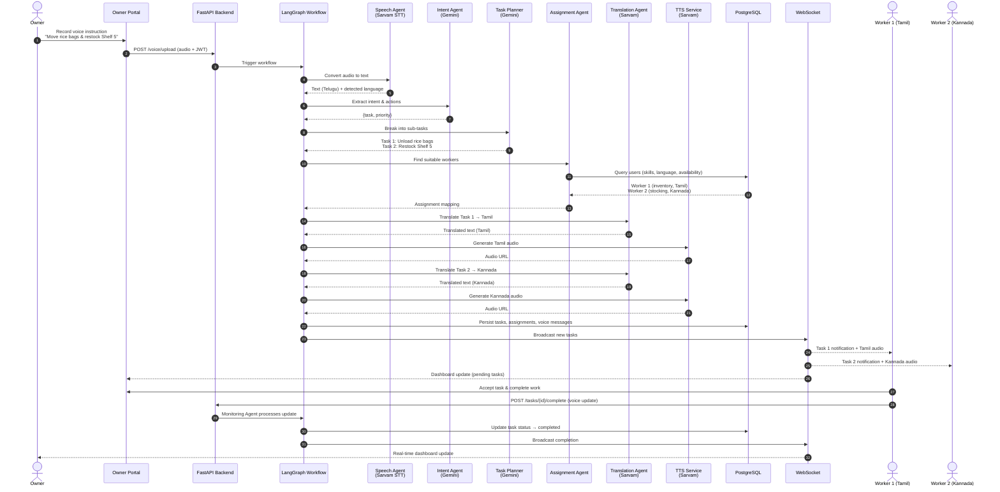
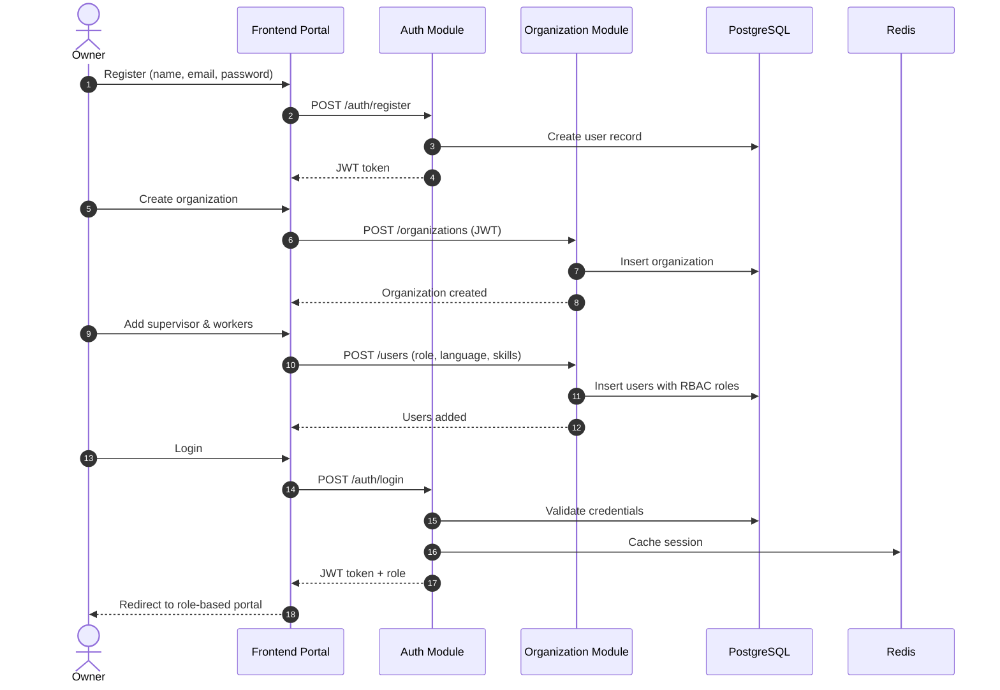
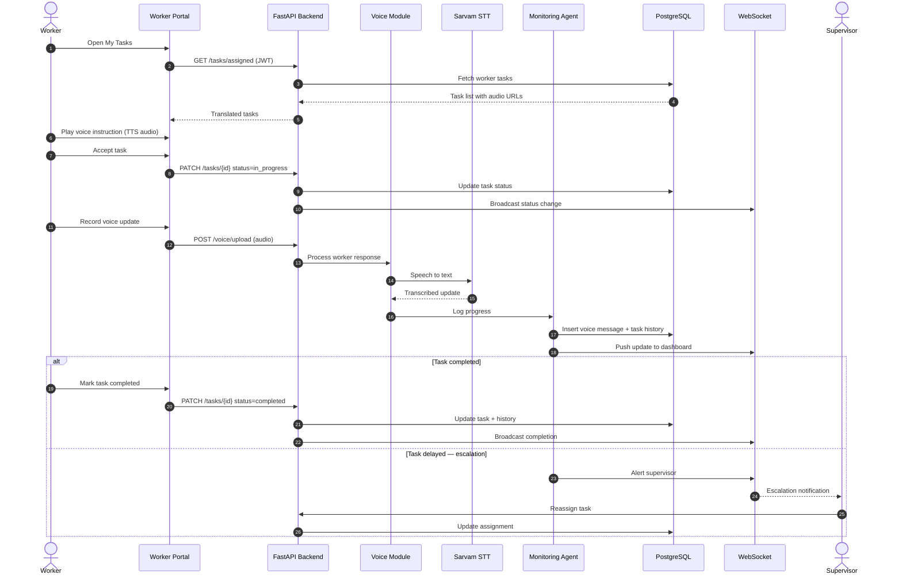
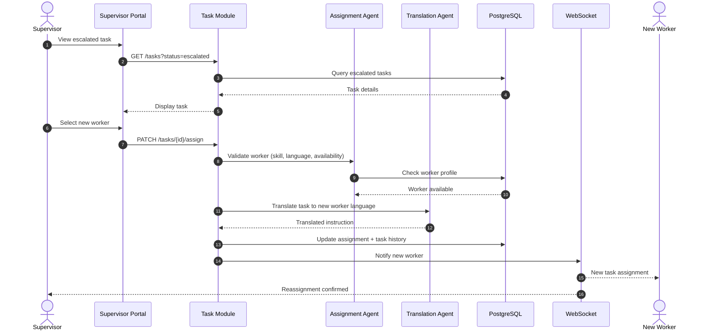

# Sequence Diagram

Interaction flows between actors, API modules, agents, and external services.

## 1. End-to-End Voice Instruction Flow

Primary scenario: Owner speaks in Telugu; workers receive tasks in Tamil and Kannada.

## 2. Authentication & Organization Setup

## 3. Worker Task Acceptance & Voice Response

## 4. Supervisor Task Reassignment

