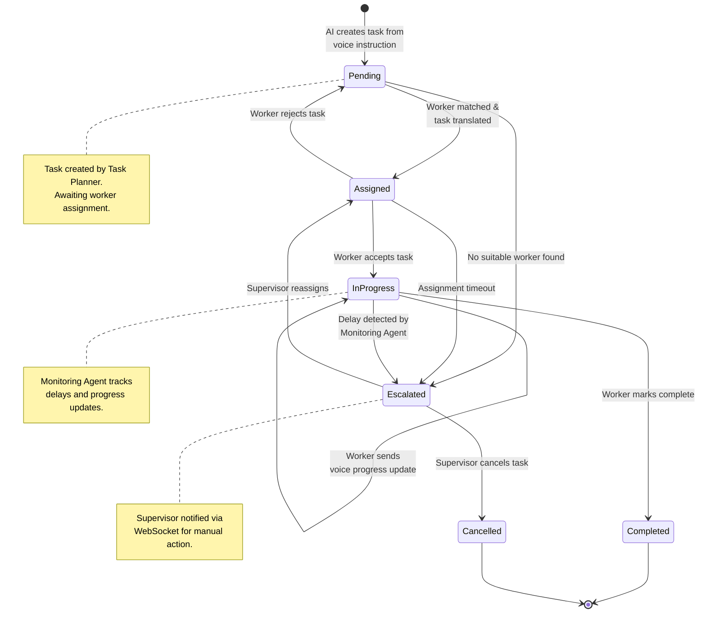
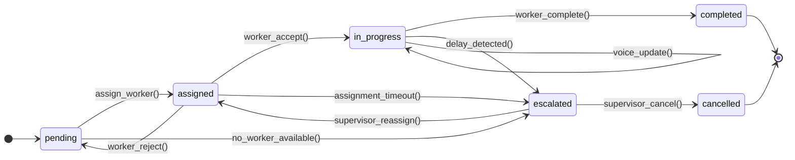
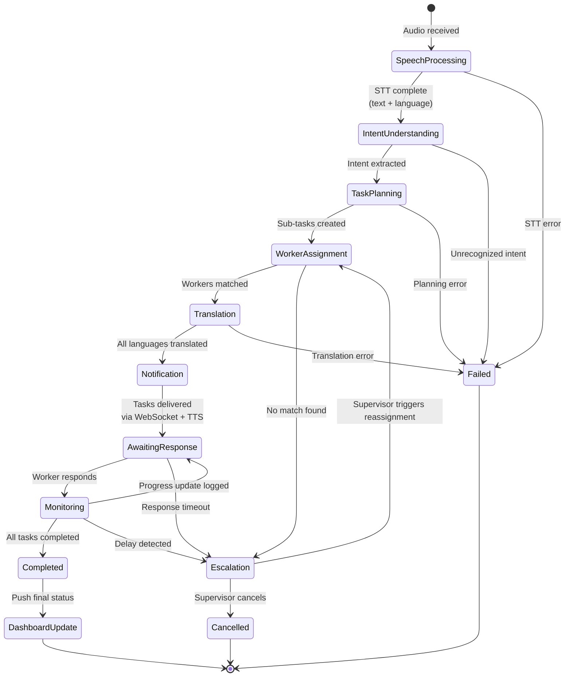
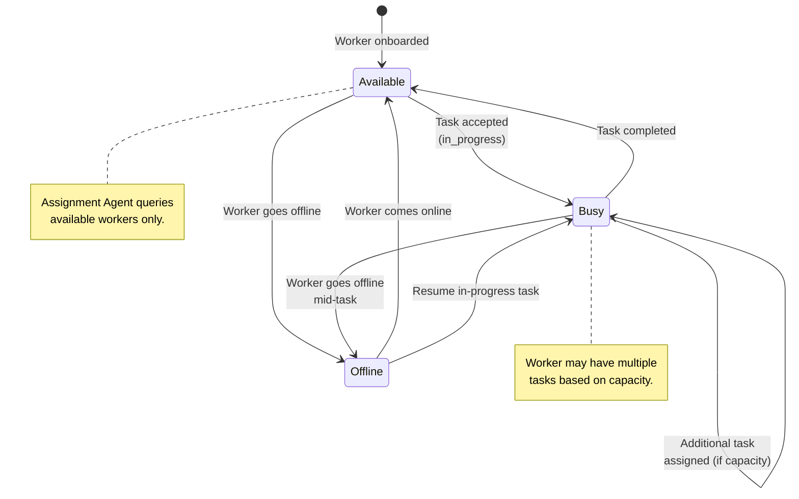
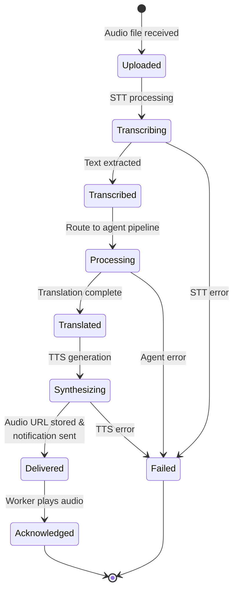

# State Machine Diagram

Lifecycle states for tasks, workers, and the LangGraph agent workflow.

## 1. Task Lifecycle State Machine

## 2. Task Status Transitions (Detailed)

## 3. LangGraph Agent Workflow State Machine

## 4. Worker Availability State Machine

## 5. Voice Message Processing State Machine

## State Reference Table

### Task States

| State | Description | Triggered By |
|-------|-------------|--------------|
| `pending` | Task created, awaiting assignment | Task Planner Agent |
| `assigned` | Worker matched, notification sent | Assignment Agent |
| `in_progress` | Worker accepted and is working | Worker action |
| `completed` | Task finished successfully | Worker voice/button update |
| `escalated` | Requires supervisor intervention | Monitoring Agent or timeout |
| `cancelled` | Task terminated by supervisor | Supervisor action |

### LangGraph Workflow States

| State | Agent | Input → Output |
|-------|-------|----------------|
| SpeechProcessing | Agent 1 | Audio → Structured text + language |
| IntentUnderstanding | Agent 2 | Text → {task, priority} |
| TaskPlanning | Agent 3 | Intent → Sub-task list |
| WorkerAssignment | Agent 4 | Tasks → Worker mapping |
| Translation | Agent 5 | Text → Per-worker translated text |
| Notification | System | Translated text → TTS + WebSocket |
| Monitoring | Agent 6 | Worker response → Status update |
