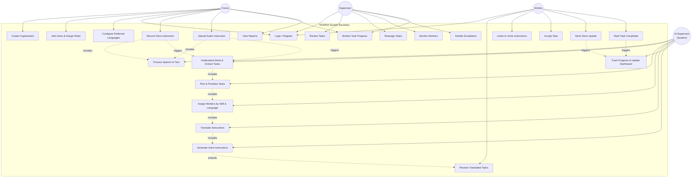
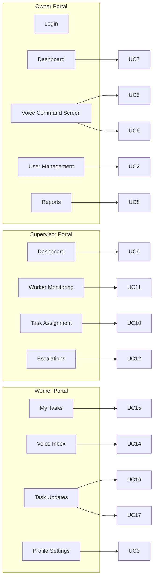

# Use Case Diagram

Actors and use cases for the Multilingual Voice-Based Workforce Management Agent MVP.

## Primary Use Case Diagram

## Use Cases by Actor

### Owner

| Use Case | Description |
|----------|-------------|
| Create Organization | Set up a new business organization in the system |
| Add Users & Assign Roles | Onboard supervisors and workers with role assignment |
| Configure Preferred Languages | Set language preferences for each user |
| Record / Upload Voice Instruction | Submit tasks via microphone or audio file |
| Monitor Task Progress | View pending, in-progress, and completed tasks |
| View Reports | Access workforce and task completion reports |

### Supervisor

| Use Case | Description |
|----------|-------------|
| Review Tasks | Inspect AI-generated and assigned tasks |
| Reassign Tasks | Manually reassign tasks to different workers |
| Monitor Workers | Track worker availability and workload |
| Handle Escalations | Resolve delayed or blocked tasks |

### Worker

| Use Case | Description |
|----------|-------------|
| Receive Translated Tasks | Get task assignments in preferred language |
| Listen to Voice Instructions | Play TTS-generated audio instructions |
| Accept Task | Acknowledge and start working on a task |
| Send Voice Update | Report progress via voice message |
| Mark Task Completed | Signal task completion |

### AI Supervisor (System)

| Use Case | Description |
|----------|-------------|
| Process Speech to Text | Convert owner/worker audio to structured text |
| Understand Intent | Extract actions and priorities from instructions |
| Plan & Prioritize Tasks | Break complex instructions into sub-tasks |
| Assign Workers | Match tasks to available workers by skill and language |
| Translate Instructions | Convert task text to each worker's language |
| Generate Voice Instructions | Produce TTS audio for workers |
| Track Progress | Monitor delays and push real-time dashboard updates |

## Portal-to-Use-Case Mapping

